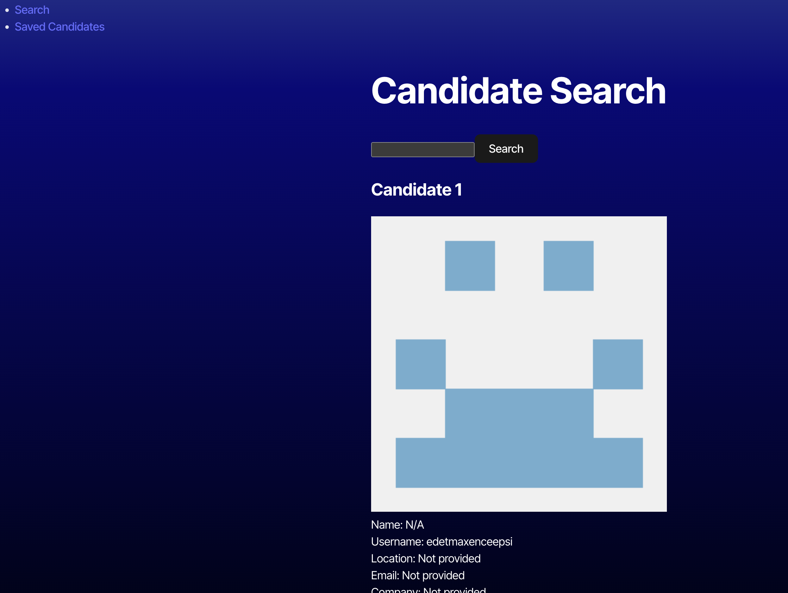
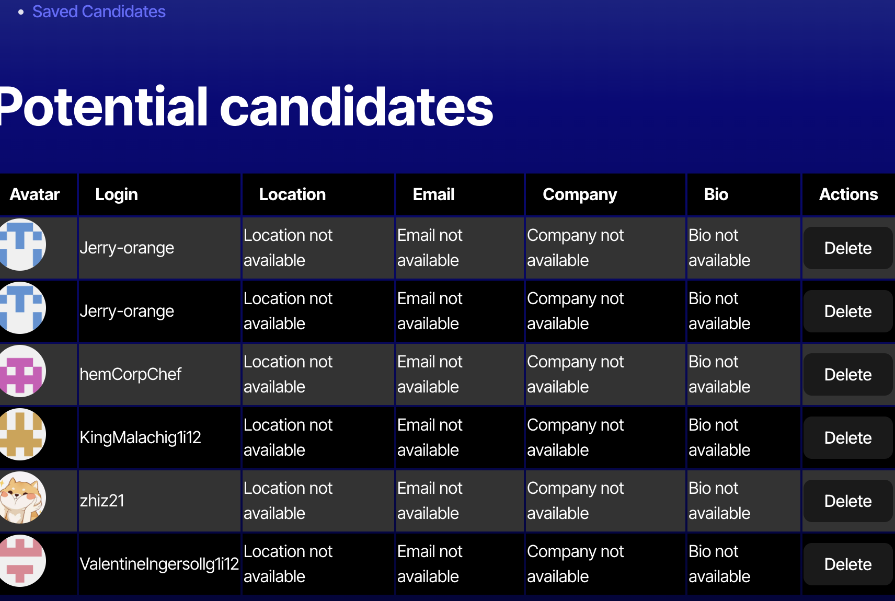

# Candidate Search Application

# Description

The Candidate Search application allows mployers to browse GitHub profiles and identify potential candidates for open positions. It fetches data from the GitHub API and enables users to save or skip candidates based on their information, such as name, username, location, avatar, email, and company. The saved candidates list persists across page reloads and can be viewed later.

# Table of Contents
 -- Installation
 Usage
 Technologies Used
 License
 Screenshots
 Deployment
 
 
 ## Installation

Clone the repository to your local machine.

Navigate to the project directory.
Install the dependencies.
npm install

Create a .env file in the root directory and add your GitHub Personal Access Token:
makefile.
Copy code
VITE_GITHUB_TOKEN=your_github_token_here
Start the development server.
npm run dev

## Usage
On the Candidate Search page, you will see the details of a candidate pulled from GitHub.
Click the "+" button to save the candidate and view the next one.
Click the "-" button to skip the current candidate and view the next one without saving.
Navigate to the Potential Candidates page to view saved candidates.
The saved candidates list persists across page reloads.

## Technologies Used
TypeScript
React
Node.js
Express
GitHub REST API
LocalStorage (for front-end state persistence)
Render (for deployment)

Screenshots
Candidate information with options to accept or skip.

# List of saved candidates with their details.

 # Git Repo link
 https://github.com/lekshmisree89/react-typescript-challenge

# Deployment
The application is deployed on Render. You can access the live version here.
https://react-typescript-challenge.onrender.com

